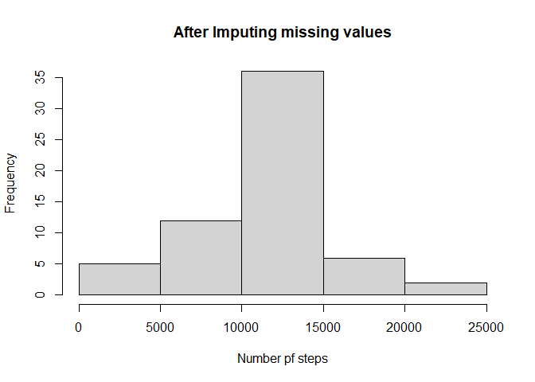

## Loading and preprocessing the data

Loadind the csv file


```r
library(ggplot2)
activity <- read.csv(file="activity.csv", header=TRUE)
```


## What is mean total number of steps taken per day?

1.Total steps taken per day


```r
totalsteps<-aggregate(steps~date,activity,FUN=sum)
```

2.Histogram of the total number of steps taken per day


```r
hist(totalsteps$steps,main="Total steps per day",xlab="Number of steps")
```

[](PA1_template_files/figure-html/unnamed-chunk-3-1.png)<!-- -->

3.Mean and median of the total number of steps taken per day


```r
meanSteps <- mean(totalsteps$steps, na.rm = TRUE)
medianSteps <- median(totalsteps$steps, na.rm = TRUE)
```

## What is the average daily activity pattern?

1.Time series plot of the 5-minute interval (x-axis) and the average number of steps taken, averaged across all days (y-axis)


```r
mean_steps_int <- aggregate(steps ~ interval, activity, mean)
ggplot(data = mean_steps_int, aes(x = interval, y = steps)) +
  geom_line() +
  ggtitle("Average Daily Activity Pattern") +
  xlab("5-minute Interval") +
  ylab("Average Number of Steps") +
  theme(plot.title = element_text(hjust = 0.5))
```

<!-- -->

2.The 5-minute interval, on average across all the days in the dataset, which contains the maximum number of steps


```r
maxiint <- mean_steps_int[which.max(mean_steps_int$steps),]
```

## Imputing missing values

1.Total number of missing values in the dataset


```r
missingvalues <- is.na(activity$steps)
NROW(missingvalues)
```

```
## [1] 17568
```

2.Replacing these missing values with the 5-day average of that respective interval and creating new dataset


```r
new_activity_data <- transform(activity,steps = ifelse(is.na(activity$steps),
                                  mean_steps_int$steps[match(activity$interval, 
                                    mean_steps_int$interval)],
                                      activity$steps))
```

3.Histogram of the total number of steps taken each day

```r
newsteps<- aggregate(steps ~ date, new_activity_data, FUN=sum)
hist(newsteps$steps,main="After Imputing missing values",xlab="Number pf steps")
```

<!-- -->

4.Impact of new mean,median,Totalsteps


```r
newmeansteps<-mean(newsteps$steps,na.rm=TRUE)
newmediansteps<-median(newsteps$steps,na.rm = T)
diff_mean=newmeansteps-meanSteps
diff_median=newmediansteps-medianSteps
diff_total=sum(newsteps$steps)-sum(totalsteps$steps)
```

The diffrence between both the means are 0
The diffrence between both the median is 1.188679
The diffrence in total steps is 86129.51

## Are there differences in activity patterns between weekdays and weekends?

1.Creating a new factor variable in the dataset with two levels – “weekday” and “weekend” indicating whether a given date is a weekday or weekend day


```r
DayType <- function(date) {
  day <- weekdays(date)
  if (day %in% c('Monday', 'Tuesday', 'Wednesday', 'Thursday', 'Friday'))
    return ("weekeday")
  else if (day %in% c('Saturday', 'Sunday'))
    return ("weekend")
  else
    stop ("Invalid Date Format.")
}
new_activity_data$date <- as.Date(new_activity_data$date)
new_activity_data$day <- sapply(new_activity_data$date, FUN = DayType)
```

2.Plot containing a time series plot of the 5-minute interval (x-axis) and the average number of steps taken, averaged across all weekday days or weekend days (y-axis)


```r
meanStepsbyDay <- aggregate(steps ~ interval + day, new_activity_data, mean)
ggplot(data = meanStepsbyDay, aes(x = interval, y = steps)) + 
  geom_line() +
  facet_grid(day ~ .) +
  ggtitle("Average Daily Activity Pattern") +
  xlab("5-minute Interval") +
  ylab("Average Number of Steps") +
  theme(plot.title = element_text(hjust = 0.5))
```

<!-- -->
